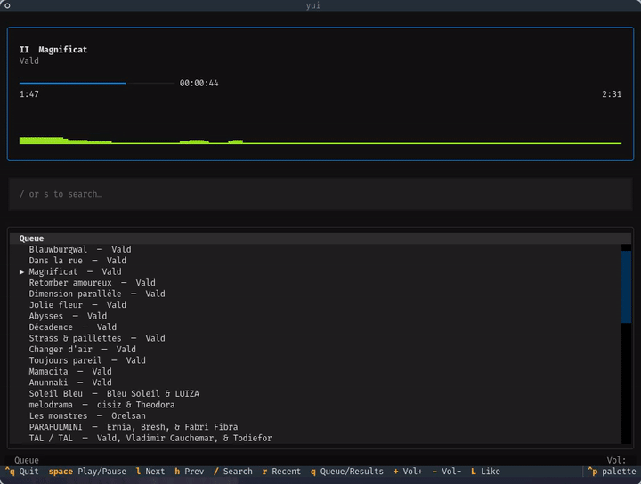

# yui

A YouTube Music TUI powered by a headless Brave browser.



## Requirements

### System packages

```bash
# Debian / Ubuntu
sudo apt install \
  xvfb \
  brave-browser \
  python3-gi \
  gir1.2-ayatana-appindicator3-0.1
```

> **Brave not in apt?** Install it from [brave.com/linux](https://brave.com/linux/) — yui will find it automatically whether installed via apt, Flatpak, or Snap.
> You can also point to a custom binary with `export BRAVE_PATH=/path/to/brave`.

### Python

- Python 3.10+ (system)
- [uv](https://docs.astral.sh/uv/getting-started/installation/)

```bash
curl -LsSf https://astral.sh/uv/install.sh | sh
```

### Playwright browsers

```bash
uv run playwright install chromium
```

## Installation

```bash
git clone https://github.com/yourname/yui
cd yui
uv tool install -e .
```

## First-time login

yui reuses your existing Brave session. If you have never signed in to YouTube Music in Brave, run:

```bash
yui --login
```

A visible browser window will open. Sign in to your Google account, then close it. yui will remember the session for all future runs.

## Usage

```bash
yui          # start daemon + system tray (first run), or open TUI (daemon already running)
yui --login  # re-authenticate
yui --daemon # run daemon in the foreground (for debugging)
```

### System tray

| Action | Result |
|---|---|
| Left-click | Open TUI in a new terminal |
| Right-click → Open yui | Same |
| Right-click → Restart daemon | Kill and restart the background browser |
| Right-click → Quit | Stop daemon and exit tray |

### TUI keybindings

| Key | Action |
|---|---|
| `/` or `s` | Search |
| `Enter` | Play / open album or artist |
| `Space` | Play / Pause |
| `l` / `h` | Next / Previous track |
| `+` / `-` | Volume up / down |
| `L` | Like current track |
| `r` | Show recently played |
| `q` | Toggle queue / results |
| `Esc` / `Ctrl+P` | Go back |
| `Ctrl+N` | Go forward |
| `g` `g` | Jump to top |
| `G` | Jump to bottom |
| `g` `a` | Go to artist |
| `Ctrl+D` / `Ctrl+U` | Page down / up |
| `V` | Visual select mode |
| `d` | Delete selected from queue (visual mode) |
| `p` | Add selected to queue (visual mode) |
| `J` / `K` | Move queue items down / up (visual mode) |
| `Ctrl+Q` | Quit |

## Architecture

```
yui (system tray)
  └── yui --daemon          background process, owns Brave + Xvfb
        └── Unix socket     ~/.config/yui/daemon.sock
              └── yui (TUI) thin client, connects on demand
```

Data files:

| Path | Purpose |
|---|---|
| `~/.config/yui/daemon.sock` | IPC socket |
| `~/.config/yui/daemon.pid` | Daemon PID |
| `~/.config/yui/browser-profile/` | Brave profile used by yui |
| `~/.config/yui/history.json` | Recently played (max 50) |

## Neovim plugin

[tilaktilak/nvim-yui](https://github.com/tilaktilak/nvim-yui) integrates yui into Neovim — control playback, search, and browse your queue without leaving the editor.

```lua
-- lazy.nvim
{ "tilaktilak/nvim-yui" }
```

## Autostart

To launch yui automatically at login, add it to your window manager's autostart. For example in `~/.config/qtile/config.py`:

```python
from libqtile import hook
import subprocess

@hook.subscribe.startup_once
def autostart():
    subprocess.Popen(["yui"])
```

Or create `~/.config/autostart/yui.desktop`:

```ini
[Desktop Entry]
Type=Application
Name=yui
Exec=yui
Hidden=false
X-GNOME-Autostart-enabled=true
```
